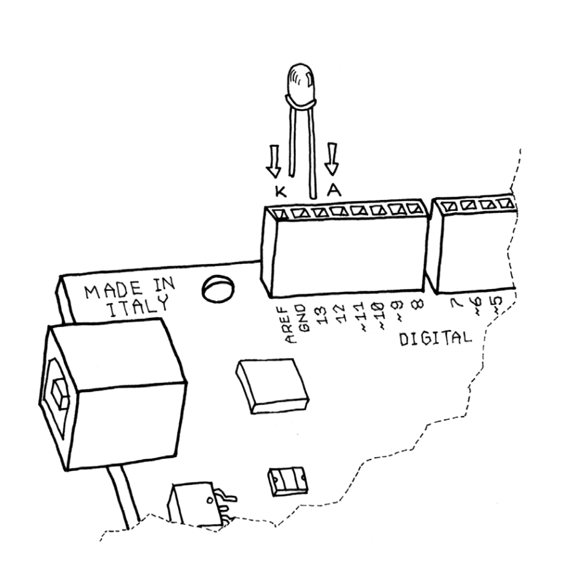
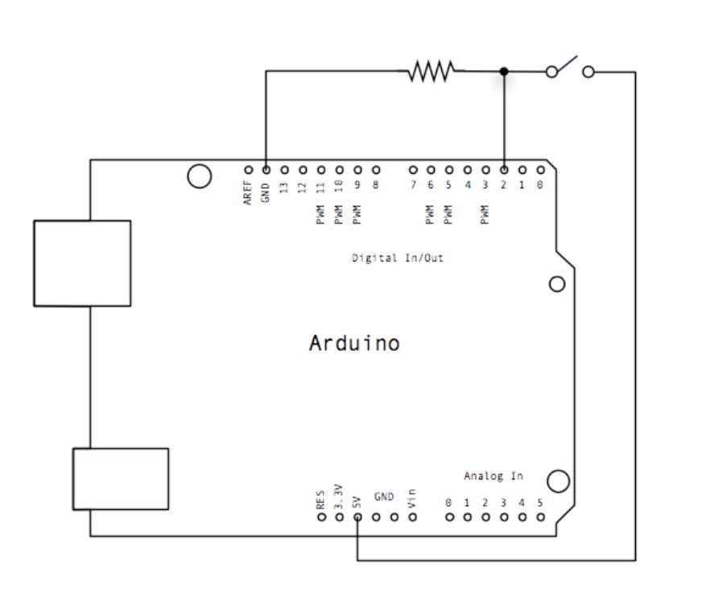
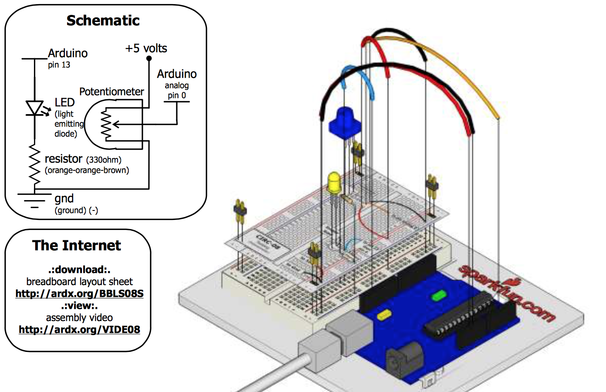
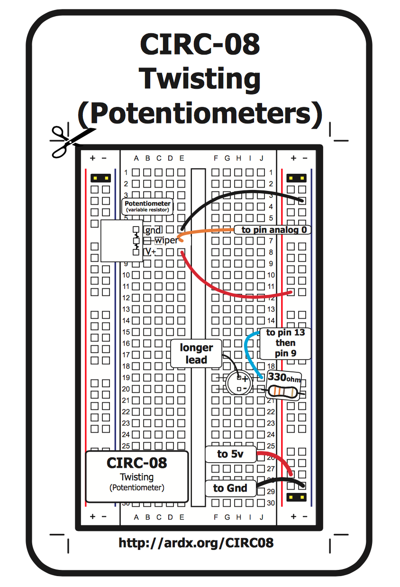
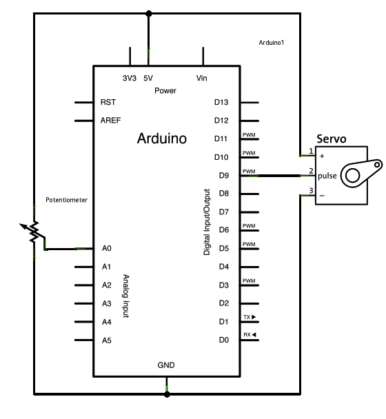

# Day 1: Arduino

## What is Arduino?

An Arduino is basically a tiny computer than you can program so that it can process certain forms of input and output. Arduino is built to make it easy for you to play around, try things out, and reuse materials for different interactive projects. In other words, it’s made for tinkering and prototyping, but can also be used as a dedicated piece for a project (hence the lowish cost). Arduino combines open source hardware with an integrated development environment (IDE) software that uses a simplified version of the C/C++ programming languages so that even non-programmers can learn to write code for the Arduino board.

## Some Terminology

* **Microcontroller**: A small computer that is contained within an integrated circuit, or IC (otherwise known as a microchip). Microcontrollers are programmed to perform sets of simple operations, and are found in most devices (a thermostat, a car’s computer, etc.).
* **Open-source**: A development model started within the software programming community that promotes universal access to source code and decentralized modes of peer-production to counter the model of proprietary, “black-boxed” code. More recently, the term “open source” (coined by nanotechnologist Christine Peterson) has been applied to hardware, where hardware developers freely share their designs with an intent to enable others to build or alter their original designs.
* **Arduino**: An open-source hardware platform that consists of a board with a programmable microcontroller; various power, input, and output pins; some LEDs; and a USB connector. The Arduino works with an integrated development environment (IDE), the software used to program the board to behave in a certain way. Its hardware reference designs are distributed under a Creative Commons Attribution Share-Alike license, which means that anyone can make their own Arduino based on the original design.
* **Components**:  Parts of a circuit that change the behaviour of an electrical current. This includes sensors, such as buttons, potentiometers, and photoresistors, as well as resistors, capacitors, transistors, batteries, and hookup wire. 
* **Breadboard**: A type of prototyping board that enables you to design circuits without having to solder the components. Essential for designing things with Arduino.
* **Input and Output (I/O)**: The communication between the computer/microcontroller system and the outside world through signals or data. Input is received by the system, and output is sent from the system.
* **Digital I/O**: Digital I/O is expressed as a string of binary commands (1s and 0s, which each indicate an on/off state). In an * Arduino, whether the value is 1 or 0 is usually determined by the voltage: when the voltage is above a threshold, the Arduino reads this as “on,” and when the voltage is below the threshold, it is read as “off.” In other words, there are only two states, on and off—digital I/O basically works like a switch.
* **Analog I/O**: Analog input and output expresses the voltage level across a variable resistance as numerical values. In other words, unlike digital I/O, which has only two states, analog values can have a range of states (on the Arduino, the input voltage can be expressed as a value between 0 and 1023)—analog I/O works like a dial or a slider.
* **Sensors and Actuators**: These are electronic components that allow the microcontroller to communicate with its environment. Sensors sense various aspects of their environment (light, capacitance, temperature, etc.) and translate them into electricity that the Arduino can read so decisions can be made based on the code you wrote. Actuators then perform certain behaviours (e.g. an LED lighting up or a motor spinning) through the reverse process of transduction (converting code to electricity to light, movement, etc.).
* **Resistance**: Resistance (Ω) hinders the flow of electric current. With the Arduino, resistance is important in the context of sensor expression—a sensor expresses its outputted data as a resistance value. For example, a photoresistor increases the resistance to the current it outputs to the Arduino when it is exposed to more light, and decreases the output when less light is exposed.
* **LED**: A light-emitting diode (LED) is a type of semiconductor: it only allows electricity to flow in one direction. When connected to a suitable voltage, LEDs release energy in the form of photons; this process is called electroluminescence, which is responsible for the production of different colours of light (depending on the energy of the photon released).
* **Potentiometer**: a potentiometer (pot) is a type of variable analog resistor that allows an operator to change the level of resistance by turning a dial, which is connected to a wiper that shortens or lengthens the part of a strip of conductive material that is exposed to the electrical current.
* **Photoresistor**: Variously called a photoresistor, a light-dependant resistor (LDR), or a photocell, this component variates its resistance according to how much light it is exposed to—typically, a photoresistor will range from 50 ohms to 1k ohms (i.e. less resistance) in direct exposure and from 5k ohms to several MegaOhms (i.e. more resistance) in the dark.
* **Servomotor**: a servomotor (servo) is a type of rotary actuator that receives data that directs its speed and final position. This data is typically controlled by some kind of variable resistance, such as a potentiometer or photoresistor.

## Basic Elements of Arduino

### The board:
* ATmega 28 - this is the actual microcontroller that has all the programmable functions you work with when you use an Arduino. All the other components on the board are for you and your computer to work with the Arduino.
* USB connector - this is where you hook up the USB cable to your computer.
* Power jack - you can hook up battery or adapter power through this.
* Digital IO pins 0-13 - you can hook up digital sensors and actuators to these pins.
* Analog In pins 0-5 - you can hook up analog sensors to these pins.
* Analog Out pins 2, 5, 6, 9, 10, 11 - you can program these digital pins to output for analog actuators.

### The software:
* The Arduino Integrated Development Environment (IDE) (<http://www.arduino.cc/en/Main/Software>) is a special software program designed for you to write sketches that can be loaded onto your Arduino to effect certain behaviours. The programming language for Arduino is modelled after Processing (https://processing.org/download/), which is based on the C/C++ languages. The software has a compiler built into it, which translates the sketch you write into a language understood by the Arduino microcontroller.

## Setup Step 1 – Install Arduino and Familiarize with IDE

* Download Arduino (<http://www.arduino.cc/en/Main/Software>) 
* Mac: Once you’ve downloaded the IDE, you should see it in your downloads folder (or in the folder that your downloaded files get saved in). You should now be able to open the IDE by double clicking on the icon. Feel free to move it into a different folder (e.g. Applications). Once you’ve opened the software, plug in the USB connector we’ve provided.
* PC: When you download the Arduino IDE, you should be prompted to install Arduino. Follow the directions and install it in your Program Files or whereever you would like to save it to. Once the process is complete, open the Arduino program and plug in the USB connector we’ve provided.

## Setup Step 2 – Serial Port and Board Selection

* Mac Port Selection: Go to the Tools menu and hover over Serial Port. You’ll see a list of ports. One will begin with /dev/tty.usbmodem and one will begin with /dev/cu.usbmodem. Select one of these two.
* Mac Board Selection: Go to the Tools menu and hover over Board. Select the type of board you are using (in this case, Arduino Uno).
* PC Port Selection: Go to the Tools menu and hover over Port. Select the one that indicates “Arduino Uno” in brackets.
* PC Board Selection: Go to the Tools menu and hover over Board. It might already have preselected “Arduino Uno.” If not, select it from the menu.

## Exercise 1 – Blinking LED

* Plug an LED into pin 13 and GND. The longer leg, the Anode, should go into pin 13. The shorter leg, the Cathode, goes into GND.

 

*Image 1: Blinking LED image from Getting Started with Arduino by Massimo Banzi (<http://phylab.fudan.edu.cn/lib/exe/fetch.php?media=yuandi:arduino:getting_started_with_arduino_v2.pdf>)*

* Once it’s hooked up, open the Arduino IDE. We will now insert the code to tell the Arduino what to do.
* Go to *File > Examples* and select *Blink* under *1. Basics*. This opens a new window with the sketch that tells the Arduino to blink the LED.
* In the sketch window, you can click on the checkmark icon to compile your code. If you have any errors in it, you will receive a message at this point.
* Next, make sure you still have the correct Serial Port and Board selected.
* The arrow icon loads the code onto your Arduino board. Click on this now. You’ll see a confirmation message once the code has finished uploading.
* If everything works fine, you should now see the LED turn on for a second and then off for a second. If not, let’s troubleshoot together.

## Exercise 2 – Incorporating a Button

Now that we have the LED blinking, let’s add a button as a digital input sensor to control when it turns on or off.

* Start by hooking up the circuit using your breadboard. Insert the button across the middle bridge on the breadboard. Hook up the bottom left leg of the button to 5V on the Arduino. Hook up the top right leg of the button to digital pin 2. Add the resistor with one leg along the same path as the bottom right leg of the button, and then connect the other leg of the 10k Ohm resistor (brown-black-orange) to GND.

*Image 2: Fritzing Circuit from Arduino Tutorials (<http://www.arduino.cc/en/Tutorial/Button>)*

*Image 3: Schematic from Arduino Tutorials (<http://www.arduino.cc/en/Tutorial/Button>)*

* Next, open your Arduino IDE and go to *File > Examples > 2. Digital > Button* and open that sketch.
* Once the code is uploaded and your circuit is built, connect the Arduino to your computer using the USB cable and make sure the correct board and port are selected (under Tools). In the IDE window, click on the checkmark icon to compile the code and make sure there are no errors. If error messages display in the bottom of your window, let’s troubleshoot.
* Once your code is free of errors, click on the arrow icon in the IDE window to load the code onto the Arduino. Now try to turn on the LED by pushing the button on the circuit. If it’s not working, review all your connections and we can troubleshoot together.

## Exercise 3 – Using a Potentiometer for Analog Input

Next, let’s incorporate analog input. Instead of allowing for only two states (On/Off or High/Low), analog input translates voltage (from 0 to 5 volts) into numbers between 0 and 1024.

* Begin by building the circuit. Stick the potentiometer and the LED into the breadboard (make sure each leg has its own connecting line along a number). To the shorter leg of the LED (the cathode), connect a 330 Ohm resistor (orange-orange-brown) to GND. Next, connect the longer leg of the LED (the anode) to digital pin 9 on the Arduino. Now, let’s move on to the potentiometer. Hook up the right leg to GND, the middle leg to analog pin A0, and the left leg to 5V.

*Image 4: Potentiometer Circuit Schematic and Visual from Spark Fun Inventor’s Guide (<https://www.sparkfun.com/tutorial/AIK/ARDX-EG-SPAR-WEB.pdf>)*

*Image 5: Potentiometer Circuit Sheet from Spark Fun Inventor’s Guide (<https://www.sparkfun.com/tutorial/AIK/ARDX-EG-SPAR-WEB.pdf>)*

* Now go to your Arduino IDE. The code for this circuit can be found in the Arduino Example sketches, so go to File > Examples > 3. Analog > AnalogInput and open that sketch.
* Click the checkmark icon to make sure there are no issues with the code. 
* Then, connect your Arduino using the USB cable, make sure the right board and port are selected, and click the arrow icon to load the code onto the Arduino.
* The LED should now be blinking. Turn the dial of the potentiometer to adjust the speed. If it’s not working, check your circuit and code to troubleshoot.

## Exercise 4 – Using a Potentiometer to control a servo motor

For this sketch, we will use a different actuator—a servo motor—and control its position using a potentiometer. As in the previous exercise, the analog input of the potentiometer will translate voltage into numbers between 0 and 1024. The sketch we use will translate the position of the potentiometer as a degree of rotation between 0 and 180. This coordinate will instruct the servo to rotate its drive shaft to that fixed position.

* This circuit is simple and at first requires only the potentiometer, the servo motor, and some hookup wire. First, place the potentiometer into the breadboard (just like the last exercise). Connect the rightmost terminal of the potentiometer to a pin on the positive (+) strip on your breadboard, the leftmost terminal to one of the ground pins on the Arduino, and the middle terminal to analog pin 0 on the Arduino. Next, connect your potentiometer to the breadboard. (Note that the wires on your potentiometer will be either in the configuration black-red-white or brown-red-orange—these are analogous to each other.) Connect the black/brown wire to a ground pin on the Arduino, the red wire to a pin on the positive (+) strip on the breadboard, and the white/orange wire to digital pin 9 on the Arduino. Connect the positive strip on the breadboard to the 5v pin on the Arduino.

*Image 5: Potentiometer-controlled Servo Circuit from Arduino.cc (<http://www.arduino.cc/en/uploads/Tutorial/knob_BB.png>)*

*Image 6: Potentiometer-controlled Servo Circuit schematic from Arduino.cc (<http://www.arduino.cc/en/uploads/Tutorial/knob_schem.png>)*

* Now go to your Arduino IDE. The code for this circuit can be found in the Arduino Example sketches, so go to File > Examples > Servo > Knob and open that sketch.
* Click the checkmark icon to make sure there are no issues with the code. 
*Then, connect your Arduino using the USB cable, make sure the right board and port are selected, and click the arrow icon to load the code onto the Arduino.
* The servo should automatically rotate to the position indicated by the position of the potentiometer. Try rotating the dial on the potentiometer—the servo should move accordingly. It may or may not shake or vibrate—this just means that it’s receiving too much voltage through the upper limit of the potentiometer. Just rotate the potentiometer until the servo runs smoothly.

